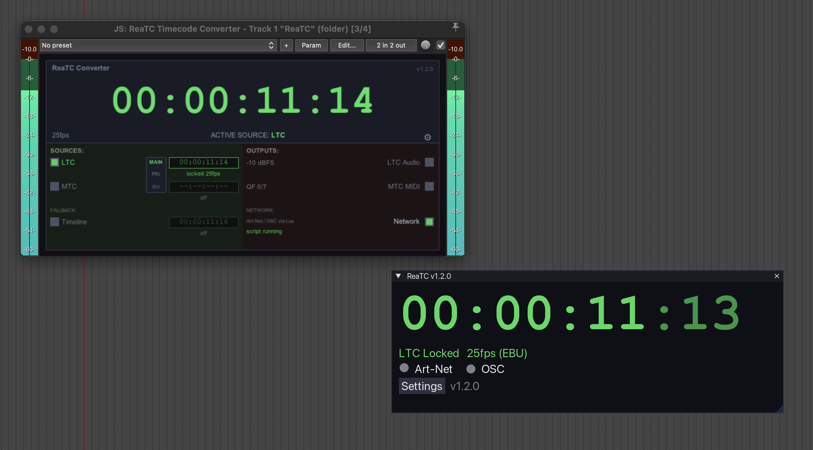
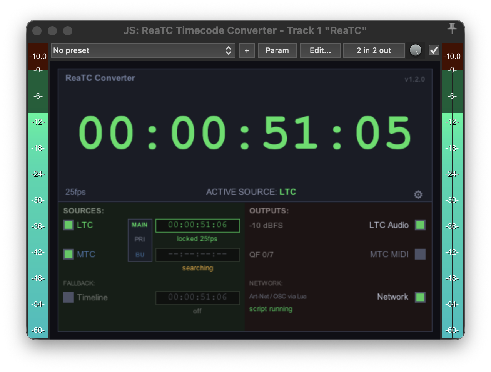
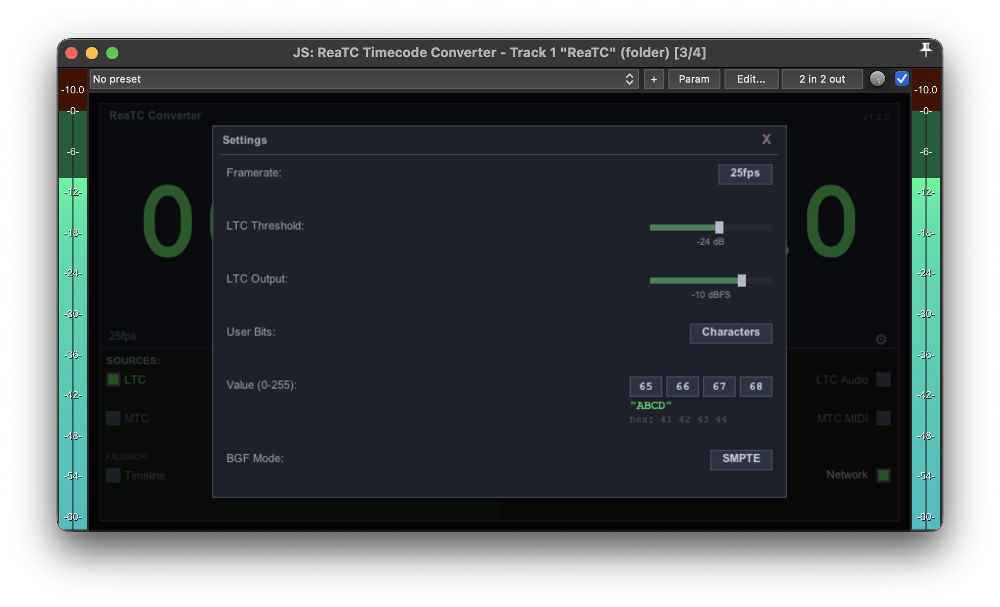
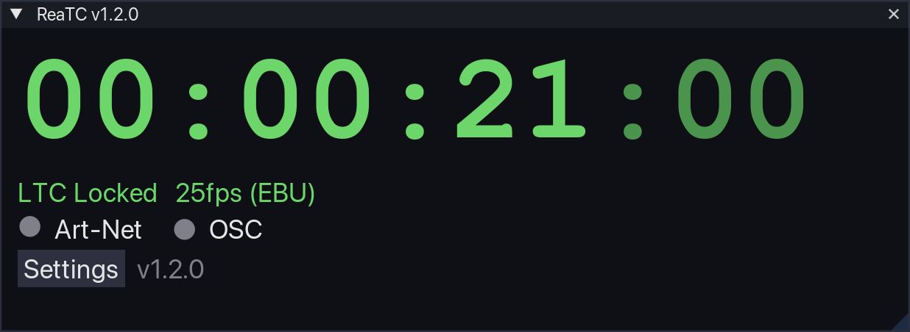
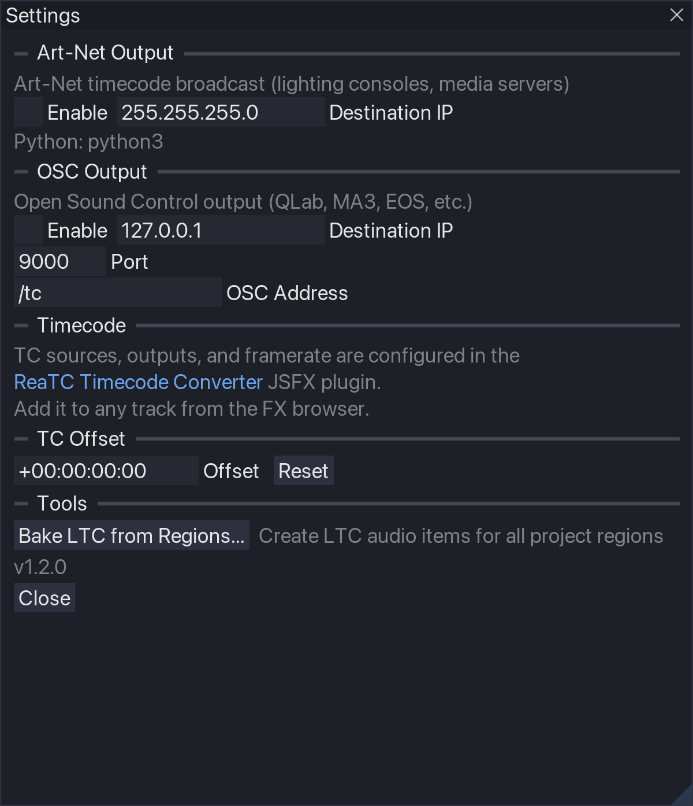

# ReaTC

[](LICENSE)
[](https://github.com/paskateknikko/ReaTC/releases)
[](https://github.com/paskateknikko/ReaTC/actions/workflows/check.yml)
[](https://github.com/paskateknikko/ReaTC/actions/workflows/release.yml)
[](https://github.com/paskateknikko/ReaTC/releases)
[](https://github.com/paskateknikko/ReaTC/releases)

Sync REAPER with your lighting console using Art-Net, MIDI Timecode, and OSC.

### Utility for lighting programmers using REAPER



## Installation

### Via ReaPack (Recommended)

1. Install [ReaPack](https://reapack.com/) if you haven't already
2. Extensions > ReaPack > Import repositories
3. Add this URL:
```
https://github.com/paskateknikko/ReaTC/raw/reapack/index.xml
```
4. Extensions > ReaPack > Browse packages → search "ReaTC" → Install


---


## Features

### Timecode Sources
- **LTC audio decoder** — real-time biphase-mark decoding with adaptive clock recovery; auto-detects frame rate (24/25/29.97DF/30); configurable threshold; varispeed support
- **MTC input** — receives and decodes MIDI Timecode quarter-frame and full-frame SysEx messages; instant locate; 2-frame lag compensation
- **REAPER Timeline** — reads timecode directly from transport position
- **Source priority system** — each source configurable as High/Normal/Low priority with automatic failover

### Timecode Outputs
- **Art-Net TimeCode** — broadcasts SMPTE TC over UDP (port 6454); unicast or broadcast; configurable IP
- **MIDI Timecode (MTC)** — sample-accurate quarter-frame generator via JSFX; no external MIDI library required
- **OSC** — broadcasts SMPTE TC as raw OSC (`/tc ,iiiii H M S F type`) at ~30 fps; configurable destination IP, port, and address
- **LTC audio generator** — encodes timecode to LTC audio with rise-time filtering per SMPTE 12M spec
- **Bake LTC from regions** — standalone tool generates offline LTC WAV files from project regions with per-region TC start, FPS, and output level

### General
- **TC Offset** — user-configurable HH:MM:SS:FF offset applied before all outputs; supports drop-frame wrap-around
- **Network sync status** — Art-Net and OSC indicators show packet counts and daemon health
- **All standard frame rates** — 24fps (Film), 25fps (EBU/PAL), 29.97fps Drop Frame, 30fps (SMPTE)
- **Dark UI** — unified dark style across Lua script and JSFX; scalable TC display
- **Cross-platform** — macOS (10.15+) and Windows (10+); Python 3 standard library only
- **ReaPack compatible** — install via package manager; ReaImGui auto-installed as dependency

## Usage

### Setup

ReaTC has two components:

1. **ReaTC Timecode Converter** (JSFX plugin) — handles all TC sources and outputs
2. **ReaTC script** (Lua) — provides the UI and sends Art-Net/OSC over the network

#### Step 1: Add the JSFX plugin

1. Select the track you want to use for timecode (or create a new one)
2. Open the FX browser (click the FX button on the track)
3. Search for **"ReaTC Timecode Converter"** and add it



The JSFX plugin handles:
- **Sources**: LTC audio input decoding, MTC MIDI input decoding, REAPER timeline
- **Outputs**: LTC audio encoding, MTC MIDI quarter-frame generation, gmem bridge to the Lua script

When collapsed, the plugin shows a compact timecode display:


Click the gear icon to access JSFX settings (framerate, LTC threshold, output level):



#### Step 2: Run the Lua script

1. Actions menu > search "ReaTC" > run **Art-Net and MIDI Timecode sender for REAPER**
2. The script window shows the active timecode and output status
3. Click **Settings** to configure Art-Net and OSC destinations



### Configuring TC Sources

In the JSFX plugin UI, enable the sources you need:

- **LTC Input** — route LTC audio to the track; the decoder locks onto the signal automatically
- **MTC Input** — route MIDI containing MTC messages to the track
- **Timeline** — uses REAPER's transport position (enabled by default)

Each source has a **priority** (High / Normal / Low). When multiple sources are locked, the highest-priority source wins. Ties are broken by: LTC > MTC > Timeline.

### Configuring TC Outputs

In the JSFX plugin UI, enable the outputs you need:

- **LTC Audio** — generates LTC audio on the track's output; configure output level with the slider
- **MTC MIDI** — emits quarter-frame messages on the track's MIDI output; configure the MIDI output port via the track's I/O button
- **Script** — writes TC to shared memory (gmem) for the Lua script to read; required for Art-Net and OSC output



### Art-Net TC Output

1. Run the ReaTC script and open **Settings**
2. Set the **destination IP** (e.g., `2.0.0.1` for Art-Net unicast, or `2.255.255.255` for broadcast)
3. Enable **Art-Net Output** — packets send during playback

### OSC Timecode Output

1. Run the ReaTC script and open **Settings**
2. Set **destination IP**, **port** (default 9000), and **OSC address** (default `/tc`)
3. Enable **OSC Output** — broadcasts `/tc ,iiiii H M S F type` at ~30 fps

### Bake LTC from Regions

1. Create regions in your REAPER project
2. Run the ReaTC script, open **Settings**, click **Bake LTC from Regions...**
3. Configure TC start and framerate per region, then render
4. Rendered WAV items are placed on a `LTC [rendered]` track


## Requirements

- **REAPER 6.32+** (required for `gmem_attach()` shared memory API)
- **ReaImGui** (auto-installed via ReaPack)
- **Python 3** (pre-installed on macOS; Microsoft Store or python.org on Windows)
  No third-party Python packages required.

## License

MIT — see [LICENSE](LICENSE)
